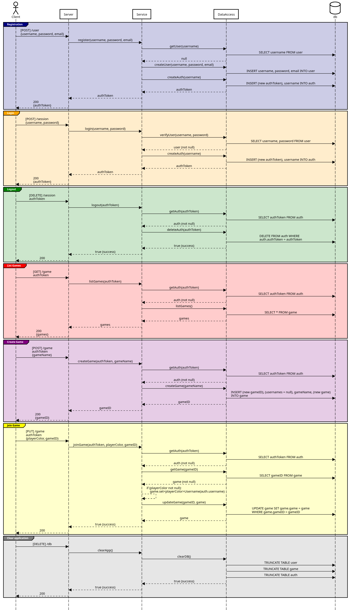

# ♕ BYU CS 240 Chess

This project demonstrates mastery of proper software design, client/server architecture, networking using HTTP and WebSocket, database persistence, unit testing, serialization, and security.

## 10k Architecture Overview

The application implements a multiplayer chess server and a command line chess client.

[](https://sequencediagram.org/index.html#initialData=C4S2BsFMAIGEAtIGckCh0AcCGAnUBjEbAO2DnBElIEZVs8RCSzYKrgAmO3AorU6AGVIOAG4jUAEyzAsAIyxIYAERnzFkdKgrFIuaKlaUa0ALQA+ISPE4AXNABWAexDFoAcywBbTcLEizS1VZBSVbbVc9HGgnADNYiN19QzZSDkCrfztHFzdPH1Q-Gwzg9TDEqJj4iuSjdmoMopF7LywAaxgvJ3FC6wCLaFLQyHCdSriEseSm6NMBurT7AFcMaWAYOSdcSRTjTka+7NaO6C6emZK1YdHI-Qma6N6ss3nU4Gpl1ZkNrZwdhfeByy9hwyBA7mIT2KAyGGhuSWi9wuc0sAI49nyMG6ElQQA)

[](https://sequencediagram.org/index.html#initialData=IYYwLg9gTgBAwgGwJYFMB2YBQAHYUxIhK4YwDKKUAbpTngUSWOZVYSnfoccKQCLAwwAIIgQKAM4TMAE0HAARsAkoYMhZkzowUAJ4TcRNAHMYABgB0AZkzGoEAK7YYAYjTAqumACUUxpBI6gkgQaK4A7gAWSGAciKikALQAfCzUlABcMADaAAoA8mQAKgC6MAD0DipQADpoAN5VlO4AtigANDC4UuHQMp0oLcBICAC+mBTpsClpbOJZUH4BsVAAFE1QrR1dyhK9UP0wg8MIAJQTrOwwMwJCouJSWcYoYACq1evVW+e3ImKSEmuqXUWTIAFEADJguBFGAbLYwABi3nyAFk4dVML97gDrjNJnMUFk0A4EAgLtQrjd5DjHjAQItBCh3pRPs1gG1Ot09n0BkMRj8af8pEC1AosgBJABy4O8sPhHO23P2h2OIxg0qK+QxtAJVNS2OFEiyDJQTOEDjAkTZm0VgruRtFII1MrBcpgqzQKHCMGAlsiRQgAGt0KdOgq2i6tb7-VihQ9AYl8Zd5jGrYGQ2gKYS8akCZk0wHg+hs5Rc-BkNosgAmMxmOr1P3p4tocboGSaOyOZwuaC8Z4wCEQfxhFxRGJxStJPOsAt5QqlCoqKQhNANiNK3Yq8b56YzymphDDpBoG1bLlbvrnPXiUWGhNZGhQJAAM10LLWG4vPSvcYdCaBZ1wShGEdVtTkdh-A4kRRdENj-P4EyTZIbyJMCPTQCBmBJMlrxTVRqX-AETUZWILStM87QQ2lE2BcUXVlWFPW9QsM1DcMvkVKNtSbSJqKNZDUKyXi2KzVDBNnKBhP9UTS2mGZ4irGBa3rBoRJbNs0A7Wx7CcVw7BQdBB2HRxmDHaJYkwRTp1mOc+EhMEijBMpymXCRVzqdTMzk0UhJgI9jFM1YvNDbN9Rge9iJgZ4wHI60QrQe1ENxFIgIc0CEpgtFC34pCUj83iMKwmAcLOMLb0I5K6RkFAEBeFA4uCmSWySmjAPo+yoScrL0UKgB1AAJN0wU8-0LEygBeViW1ygEJIPNCdAcVRVgkBwjTwhb5qfLIlpWtaNp85CKwSMAazrLQtM7XSe0WGRB2WGAAHFFUBcyJysqdmGTKYsmyJ7HJc4xFVG5tvN3Xz8KyZBAhetoJCasHQtQu94yimLGoS1rHVS+jgOhWFMuRbLeNmqRtvYaSrSK7DSTKlHKpo6HljhyRVmxgCZjSkDYQAKh66LFTJiQKdTYH4fKlBtoLcXJCOhSvvO1T6lliRNO0rs9JcbAHCgbA6vgUjVFZiILMnU7Id+nICmKIGQfcZrMwbWWpUVHdJMtwkSLNWJWcRotM06F2qIZg00bpDH-X90SOZS5JuYJ6bMwF0nIvJ-KocLGmSrpzac0Zo1vaZP3g7aWORS5+jpUYjCWNliU+DDD0N0BKbSqb0vtmYn1ZdOOpNW1WXhdFtD674SXpakwW2gb+XUmss7lLrZ3FQb9Xru7VxdFqo8fQAKQgE9nq4lwFAQUAg0+i2fp263XkXcpZdBgP0AbfXgG3qA4AgI8oCD1e+DuymJ7SmMAABWh80B+wSlyc+n9v6-3-jPRuktUZEQji8TGjtQpp1ognDK2CwjE16rGXBI8qaRGzu3VBKRcFPBeCXAB5c8F43SrCMeAsh5kIzgtJ4XFPTFWoQzHhXsYCvg9O-eBP9oAlUEbnDIdQYBKOnigCwKgwAAB5JGUAQdAZIH4tj+wsBuPO+o6FwmwHIX2ipVhjyQSgZhTp6KvFyHwYQ3VZbkEcioiwnippPzQINYaPiOH+IAcPERoCh7iREQWPaHoDoJjzmWY6C8laXQ1jdfSUAP4VjNLAYA2B9aEGCKEU2H0F6ezsg5JyLl1BHX3KIkAdU8DCCKezGhYd0HGnpC0qAfAABCHTcHtSyEUbwrwpRwHcWCGARRhADKhGBYWoy5kTKmTMuZCyllcPDiwsZ6zpndXmYs2Zqc9nkJgPE1a60kkT1iVPa5iSATJPkvPRWS8zAZMwEAA)

## IntelliJ Support

Open the project directory in IntelliJ in order to develop, run, and debug your code using an IDE.

## Maven Support

You can use the following commands to build, test, package, and run your code.

| Command                    | Description                                     |
| -------------------------- | ----------------------------------------------- |
| `mvn compile`              | Builds the code                                 |
| `mvn package`              | Run the tests and build an Uber jar file        |
| `mvn package -DskipTests`  | Build an Uber jar file                          |
| `mvn install`              | Installs the packages into the local repository |
| `mvn test`                 | Run all the tests                               |
| `mvn -pl shared test`     | Run all the shared tests                        |
| `mvn -pl client exec:java` | Build and run the client `Main`                 |
| `mvn -pl server exec:java` | Build and run the server `Main`                 |

These commands are configured by the `pom.xml` (Project Object Model) files. There is a POM file in the root of the project, and one in each of the modules. The root POM defines any global dependencies and references the module POM files.

### Running the program using Java

Once you have compiled your project into an uber jar, you can execute it with the following command.

```sh
java -jar client/target/client-jar-with-dependencies.jar

♕ 240 Chess Client: chess.ChessPiece@7852e922
```
